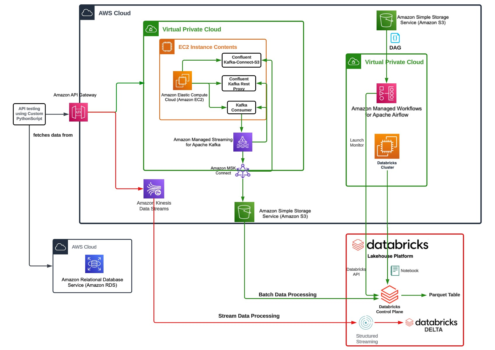

# <u>Pinterest Data Pipeline</u>

## Table of Contents:

### __1. [Overview: The Project Description](#overview-the-project-description)__
- #### __1.1 [AWS Data Pipeline Workflow](#aws-data-pipeline-workflow)__
- #### __1.2 [AWS Kafka Setup and Integration (Batch Processing)](#aws-kafka-setup-and-integration-batch-processing)__
- #### __1.2 [AWS Kinesis Setup and Integration (Streaming Processing)](#aws-kinesis-setup-and-integration-streaming-processing)__
### __2. [Installation & Usage Instructions](#installation--usage-instructions)__
### __3. [File Structure of the Project](#file-structure-of-the-project)__
- #### __3.1 [AWSDBConnector](#awsdbconnector)__
- #### __3.2 [Batch Processing](#batch-processing)__
- #### _3.2.1 [Data Transfer to Kafka Topics](#data-transfer-to-kafka-topics)_
- #### _3.2.2 [Post Data to the API](#post-data-to-the-api)_
- #### _3.2.3 [Batch Data Cleaning](#batch-data-cleaning)_
- #### _3.2.4 [Task Automation](#task-automation)_
- #### __3.3 [Stream Processing](#stream-processing)__
- #### _3.3.1 [Post Data to Kinesis Streams](#post-data-to-kinesis-streams)_
- #### _3.3.2 [Stream Data Cleaning](#stream-data-cleaning)_
### __4. [License Information](#license-information)__

---

## Overview: The Project Description

This project involves the creation of a robust This is <u>__data pipeline__</u> designed for extracting and processing data from an <u>__AWS-hosted database__</u>, specifically focusing on <u>__Pinterest data__</u>. The pipeline is engineered to manage <u>__large datasets__</u> and integrate with real-time data processing tools using <u>__AWS__</u> and <u>__Kafka__</u>.

By leveraging <u>__Spark__</u> for data processing and <u>__AWS S3__</u> for storage, the project ensures <u>__scalability__</u> and real-time <u>__data handling__</u> capabilities. The integration of <u>__Kafka__</u> for <u>__data transfer__</u> further enhances the pipeline's efficiency, making it a valuable tool for understanding and analysing <u>__large-scale data__</u>.

Cleaned data from the dataframes using <u>__Spark__</u> on <u>__Databricks__</u> & used the Databricks platform to query the data. Specific <u>__transformations__</u> included replacing empty and irrelevant entries with None, ensuring numeric data types for relevant columns, and reordering columns for better organisation. For the Pinterest posts, this involved standardising follower counts, extracting save location paths, and renaming the index column. Geolocation data was enhanced by creating coordinate arrays and converting timestamps, while user data was streamlined by combining names and converting join dates.

Created a <u>__DAG (Directed Acyclic Graph)__</u> for <u>__task automation__</u> & uploaded it to a folder in an <u>__S3 bucket__</u>. This <u>__DAG__</u> triggers a <u>__Databricks notebook__</u> to run on a daily schedule.

---

### AWS Data Pipeline Workflow

__AWS Resource Configuration__:

- S3 Bucket Setup

- Custom Plugin Development & MSK Connectors

__Data Extraction and Processing__:

- Delta Table Reading

- Mounting S3 Bucket

__Data Loading__:

- Loading JSON Data

__Data Cleaning and Transformation__:

- Coordinate Transformation

- Column Management

- Handling Missing and Inconsistent Data

- Numeric Conversion

- String Clean-up

- Column Reordering

- Name Concatenation

- Data Type Conversion

__Visualisation and Verification__:

- Data Display

- Data Schema Display

---

### AWS Kafka Setup and Integration (Batch Processing)

- Setup Kafka on EC2 Client

- Configure S3 bucket in AWS (for storing topics)

- Download Confluent (to manage & process data streams)

- Setup MSK Connect (to connect Confluent to the S3 bucket)

- Deploy REST API in AWS (so the EC2 client can make HTTP POST requests) 

- Start the Kafka REST Proxy in the EC2 client

- Post data using Python Script

---

### AWS Kinesis Setup and Integration (Streaming Processing)

- Create Kinesis Data Streams in AWS

- Configure REST API in AWS (using Kinesis access role ARN)

- Create a read file in Databricks for AWS credentials (Access key & Secret key)

- Create a cleaning file in Databricks for the data streams

- Create a write file in Databricks save the data to Delta tables

- Deploy REST API in AWS (so the EC2 client can make HTTP POST requests) 

- Start the Kafka REST Proxy in the EC2 client

- Post data using a modified streaming Python Script

- Run the read file, then clean the data and, write it to the Delta tables

---

## Installation & Usage Instructions

To run the project, you need to have the required database credentials in a YAML file and a .pem file with your RSA PRIVATE KEY.

Follow these steps:

- Clone the repository to your local machine: __`git clone https://github.com/54F-A/pinterest-data-pipeline175.git`__

- Navigate to the project directory: __`cd pinterest-data-pipeline/`__

- Install the required packages: __`pip install -r requirements.txt`__

- Ensure your db_creds.yaml file is correctly set up with your database credentials.

- Grant permissions to the .pem file: __`chmod 400 /path/to/private_key.pem`__

- Open a WSL (ubuntu) terminal & connect to the EC2 instance: __`ssh -i "<key_pair.pem>" <Public DNS>`__

- Ensure that the client.properties & kafka-rest.properties are configured.

- Navigte to the bin folder of the Confluent platform: __`cd confluent-7.2.0/bin/`__

- Start the REST proxy: __`./kafka-rest-start /home/ec2-user/confluent-7.2.0/etc/kafka-rest/kafka-rest.properties`__

- On a new terminal, run the data posting file: __`python (Batch_Processing or Stream_Processing)/user_posting_emulation_(batch or stream).py`__

---

## File Structure of the Project

### AWSDBConnector

A class to handle AWS database connections.

__Attributes__:

- config (dict): Configuration parameters loaded from the credentials file.

- HOST (str): Database host address.

- USER (str): Database username.

- PASSWORD (str): Database password.

- DATABASE (str): Database name.

- PORT (int): Database port.

__Method__:

- `__init__(self, creds_file='db_creds.yaml')`: Initialises the AWSDBConnector instance.

- `load_config(self, creds_file)`: Loads database configuration from a YAML file.

- `create_db_connector(self)`: Creates a SQLAlchemy engine for connecting to the database.

---

## Batch Processing

### Data Transfer to Kafka Topics

Extracts data from the following tables:

- pinterest_data

- geolocation_data

- user_data

__Method__:

- `Pin`: If the data contains a "pin" key, it constructs a payload with the pin data and sends it to the pin Kafka topic.

- `Geo`: If the data contains a "geo" key, it constructs a payload with the geo data and sends it to the geo Kafka topic.

- `User`: If the data contains a "user" key, it constructs a payload with the user data and sends it to the user Kafka topic.

- `post_to_api(data)`: Sends data to specific Kafka topics via an API endpoint.

__API Request__:

Sends a POST request to the appropriate Kafka topic endpoint with the constructed payload.

---

### Post Data to the API

Selects random rows from database tables and posts them to the API.

__Method__:

- `sleep(random.randrange(0, 2))`: Continuously runs, pausing for a random duration between 0 and 2 seconds in each iteration.

- `random_row = random.randint(0, 11000)`: Chooses a random row index between 0 and 11,000.

- `engine = new_connector.create_db_connector()`: Establishes a connection to the database.

- `text(f"SELECT * FROM pinterest_data LIMIT {random_row}, 1")`: Executes a SQL query to select a row from the pinterest_data table

- `pin_result = dict(row._mapping)`: Converts the result to a dictionary.

- `text(f"SELECT * FROM geolocation_data LIMIT {random_row}, 1")`: Executes a SQL query to select a row from the geolocation_data table.

- `geo_result = dict(row._mapping)`: Converts the result to a dictionary.

- `user_string = text(f"SELECT * FROM user_data LIMIT {random_row}, 1")`: Executes a SQL query to select a row from the user_data table.

- `user_result = dict(row._mapping)`: Converts the result to a dictionary.

- `data = {"pin": pin_result, "geo": geo_result, "user": user_result}`: Combines the extracted data into a dictionary with keys "pin", "geo", and "user".

- `post_to_api(data)`: Sends data via a POST request to the API based on the presence of keys ("pin", "geo", "user") in the data dictionary.

- `run_infinite_post_data_loop()`: Runs an infinite loop to select random rows from multiple database tables and posts them to the API.

---

### Batch Data Cleaning

Cleans data from the pinterest posts, geolocation & users dataframes using Spark.

__Pinterest Posts DF Cleaning Method__:

- `sleep(random.randrange(0, 2))`: Continuously runs, pausing for a random duration between 0 and 2 seconds in each iteration.

- `df_pin = df_pin.na.replace([''], None)` & `df_pin = df_pin.na.replace([float('nan')], None)`: Replaces empty entries & entries with no relevant data.

- `df_pin = df_pin.withColumn("follower_count", col("follower_count").cast("int"))`: Ensures every entry for follower_count is an integer.

- `df_pin = df_pin.withColumn("save_location", regexp_replace("save_location", "Local save in ", ""))`: Cleans the data in the save_location column to include only the save location path.

- `df_pin = df_pin.withColumnRenamed("index", "ind")`: Renames the index column to ind.

-  `df_pin = df_pin.select(...)`: Reorders the DataFrame columns.

__Geolocation DF Cleaning Method__:

- `df_geo = df_geo.withColumn("coordinates", functions.array("latitude", "longitude"))`: Creates a new column 'coordinates' that contains an array based on the latitude and longitude columns.

- `df_geo = df_geo.drop("latitude", "longitude")`: Drop the latitude and longitude columns from the DataFrame.

- `df_geo = df_geo.withColumn("timestamp", col("timestamp").cast("timestamp"))`: Convert the timestamp column from a string to a timestamp data type.

-  `df_geo = df_geo.select(...)`: Reorders the DataFrame columns.

__Users DF Cleaning Method__:

- `df_user = df_user.withColumn("user_name", concat(col("first_name"), lit(" "), col("last_name")))`: Create a new column user_name that concatenates the information found in the first_name and last_name columns.

- `df_user = df_user.drop("first_name", "last_name")`: Drop the first_name and last_name columns from the DataFrame.

- `df_user = df_user.withColumn("date_joined", col("date_joined").cast("timestamp"))`: Convert the date_joined column from a string to a timestamp data type

- `df_user = df_user.select(...)`: Reorders the DataFrame columns.

---

### Task Automation

A DAG used to automate tasks from a Databricks notebook.

__Airflow DAG Method__:

- `'notebook_path': '<DATABRICKS NOTEBOOK>'`: The Databricks notebook that will run.

- `schedule_interval='0 0 * * *'`: The task is scheduled to run daily.

---

## Stream Processing

### Post Data to Kinesis Streams

Selects random rows from database tables and posts them to specific Kinesis Streams.

__Method__:

- `if "pin" in data`: Checks if the "pin" key exists in the data dictionary.

- `invoke_url = base_invoke_url + "/test/streams/streaming-12aa97d84d77-pin/record"`: Constructs the full API URL for the "pin" stream.

- `partition_key = 'partition-1'`: Defines the partition key for the "pin" stream.

- `payload = {...}`: Constructs the payload for the "pin" stream.

- `response = requests.put(invoke_url, headers=headers, json=payload)`: Sends a PUT request to the Kinesis API with the constructed payload.

- The same is done for the "geo" & "user" stream.

- `post_to_kinesis(data)`: Sends data via a PUT request to Kinesis streams based on the presence of keys ("pin", "geo", "user") in the data dictionary.

---

### Stream Data Cleaning

Cleans data from the Pinterest posts, geolocation & users streamed dataframes using Spark.

__Pinterest Posts DF Cleaning Method__:

- `df_pin = clean_struct_fields(df_pin, "data", fields_to_clean)`: Replaces empty entries & entries with no relevant data.

- `df_pin = df_pin.withColumn("data", struct(...))`: Applies transformations to the struct field "data".

- `col("data.index").alias("ind")`: Renames the index column to ind.

- `process_follower_count(col("data.follower_count")).alias("follower_count")`: Ensures every entry for follower_count is an integer.

- `regexp_replace(col("data.save_location"), "Local save in ", "").alias("save_location")`: Cleans the data in the save_location column to include only the save location path.

- `process_downloaded(col("data.downloaded")).alias("downloaded")`: Ensures every entry for download is an integer.

- `df_pin = df_pin.select(...)`: Reorders the DataFrame columns.

__Geolocation DF Cleaning Method__:

- `df_geo = df_geo.withColumn("data", struct(...))`: Applies transformations to the struct field "data".

- `col("data.timestamp").cast(TimestampType()).alias("timestamp")`: Convert the timestamp column from a string to a timestamp data type.

- `process_latitude(col("data.latitude")).alias("latitude")`: Ensures every entry for latitude is an integer.

- `process_longitude(col("data.longitude")).alias("longitude")`: Ensures every entry for longitude is an integer.

- `array(col("data.latitude"), col("data.longitude")).alias("coordinates")`: Creates a new coordinates column that contains an array of the latitude and longitude columns.

-  `df_geo = df_geo.select(...)`: Reorders the DataFrame columns.

__Users DF Cleaning Method__:

---

## License Information

This project is licensed under the MIT License.